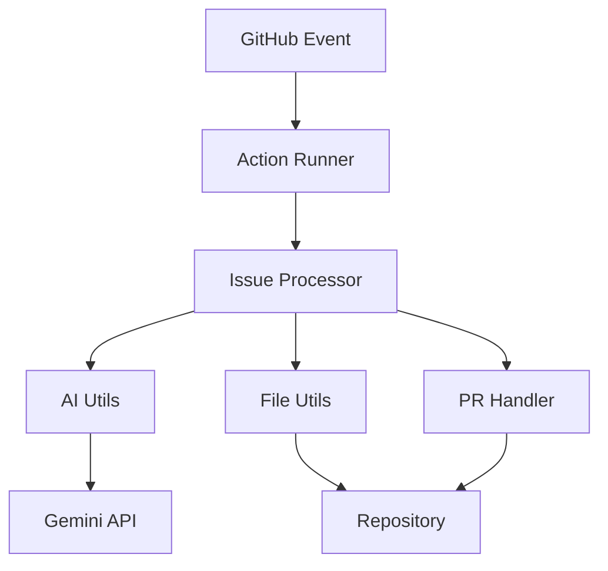

# Technical Design Document: GitHub Issue Resolution with Gemini Flash

## System Architecture

### 1. Component Overview



### 2. Core Components

#### 2.1 Event Handling
- **Entry Point**: `__main__.py`
  - Handles GitHub event parsing
  - Initializes GitHub client
  - Routes to appropriate processors

#### 2.2 Issue Processing (`issue_processor.py`)
- **Responsibilities**:
  - New issue analysis
  - Comment trigger detection
  - Response coordination
- **Key Classes/Functions**:
  - `process_issue()`: Main coordinator
  - `create_analysis_comment()`: Generates initial analysis
  - `check_triggers()`: Command detection

#### 2.3 AI Integration (`ai_utils.py`)
- **Features**:
  - Gemini API integration
  - Context-aware prompting
  - Code block parsing
- **Key Components**:
  - Model configuration
  - Safety settings
  - File handling integration

#### 2.4 File Operations (`file_utils.py`)
- **Capabilities**:
  - Repository structure analysis
  - File content reading
  - Path management
- **Key Functions**:
  - `get_repo_root()`: Working directory management
  - `get_relevant_files()`: File filtering
  - `get_file_content()`: Content retrieval

#### 2.5 PR Management (`pr_handler.py`)
- **Features**:
  - Branch creation
  - File updates
  - PR creation
- **Key Functions**:
  - `create_pr_from_analysis()`: Main PR creator
  - `update_file()`: File content manager
  - `create_branch()`: Branch management

### 3. Data Flow

#### 3.1 Issue Analysis Flow
```sequence
GitHub -> Action: Issue Created
Action -> Processor: Process Event
Processor -> AI: Request Analysis
AI -> Files: Get Context
AI -> Processor: Return Analysis
Processor -> GitHub: Post Comment
```

#### 3.2 PR Creation Flow
```sequence
GitHub -> Action: /create-pr Command
Action -> Processor: Detect Command
Processor -> PR Handler: Request PR
PR Handler -> Files: Get Changes
PR Handler -> GitHub: Create Branch
PR Handler -> GitHub: Update Files
PR Handler -> GitHub: Create PR
```

### 4. Security Considerations

1. **Authentication**:
   - GitHub token scoping
   - Gemini API key management
   - Permission validation

2. **Content Safety**:
   - AI safety settings
   - Code execution prevention
   - Input validation

3. **Rate Limiting**:
   - GitHub API limits
   - Gemini API quotas
   - Response size limits

### 5. Error Handling

1. **Layers**:
   - Event validation
   - API error catching
   - File operation safety
   - PR creation fallbacks

2. **Recovery**:
   - Graceful degradation
   - User notifications
   - Cleanup procedures

### 6. Testing Strategy

1. **Unit Tests**:
   - File operations
   - Command parsing
   - Response formatting

2. **Integration Tests**:
   - GitHub API interaction
   - Gemini API calls
   - End-to-end flows

### 7. Configuration

#### 7.1 Action Configuration
```yaml
inputs:
  github-token:
    required: true
  gemini-api-key:
    required: true
  max-tokens:
    default: '8192'
```

#### 7.2 Runtime Configuration
```python
MODEL_CONFIG = {
    'temperature': 0.7,
    'top_p': 1.0,
    'top_k': 32,
    'candidate_count': 1
}
```

### 8. Dependencies

1. **Required**:
   - Python 3.12+
   - PyGithub ≥1.55
   - google-generativeai ≥0.8.3
   - PDM (package management)

2. **Optional**:
   - Development tools
   - Testing frameworks

### 9. Future Improvements

1. **Planned Features**:
   - Multi-file PR support
   - Enhanced code analysis
   - Custom command support
   - Response templating

2. **Performance**:
   - Caching mechanisms
   - Parallel processing
   - Response optimization

3. **Integration**:
   - Additional AI models
   - CI/CD integration
   - Analytics support

### 10. Maintenance

1. **Monitoring**:
   - Error tracking
   - Usage metrics
   - Performance stats

2. **Updates**:
   - Dependency management
   - Security patches
   - API version control

### 11. Documentation

1. **Types**:
   - API documentation
   - User guides
   - Contributing guidelines

2. **Locations**:
   - Inline code docs
   - GitHub Wiki
   - README files